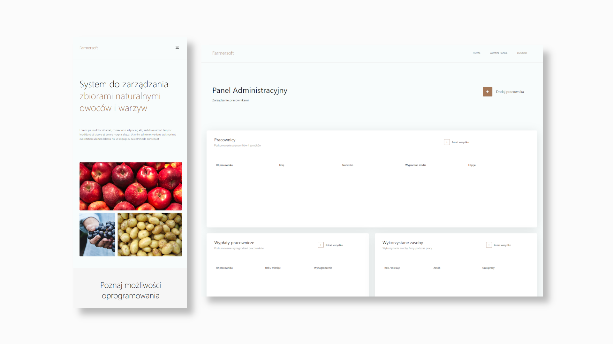

# Agriculture-Management-System
System zarządzania przedsiębiorstwem rolnym zatrudniającym pracowników.


## Features

- Nowoczesny responsywny design
- Możliwość rejestracji kont pracownikom
- Możliwość rejestracji dnia pracy przez pracownika (typ wykonanej pracy,data, wynagrodzenie obliczone na podstawie czasu pracy, użytkowane maszyny rolnicze
- Monitorowanie pracy przez poszczególnych pracowników (obliczanie czasu pracy, miesięczego przewidywanego wynagrodzenia, wyświetlanie dodanych dni pracy)
- Monitorowanie pracy przez administratora (zarządzanie pracownikami, zmiana stawki godzinowej poszczególnych pracowników, monitorowanie wykonywanych prac każdego dnia)

## Stack technologiczny
 - Oprogramowanie stworzone zostało w techologiach PostgreSQL,ExpressJS,React,Redux. Przed podjęciem kolejnych kroków upewnij się, że NodeJS jest zainstalowany na Twoim komputerze

## Instalacja bazy danych
- Zainstaluj PostgreSQL
- Utwórz bazę danych postgresql korzystając z PgAdmin lub SQL shell i zachowaj nazwę utworzonej bazy np. farmersoft
- Zmodyfikuj plik `DBconnection.js` najdujący się w folderze `.\backend\DBseeder` i ustaw `user` `host` `password`,`port` oraz `database` według danych podanych podaczas tworzenia bazy. Przykład:
```
  user: "admin",
  host: "localhost",
  password: "admin",
  port: 5432,
  database: "farmersoft",`
```
## .ENV FILES
Zmodyfikuj plik `example.envexample` w folderze `./backend`  zmieniając nazwę na `.env`. Uzupełnij danymi zmienne PORT,JWT_SECRET np.
```
PORT=5000
JWT_SECRET=abcd1234
```
## INSTALL DEPENDENCIES
Zainstaluj potrzebne zależności. W tym celu przejdź do folderu frontend `cd .\frontend\` oraz wykonaj w terminalu komendę `npm install`. Następnie powtórz czynność w folderze backend `cd ..` `cd .\backdend\` `npm install`


## DB SEEDER
Przejdź do folderu `backend\DBseeder` i uruchom w następującej kolejności pliki js które uzupełnią bazę danych przykładowymi danymi oraz stworzą tabele w PostgreSQL 
```
cd .\DBseeder\
node .\createUserTable.js
node .\createWorkTable.js
node .\createAdminUser.js
node .\createExampleUser.js


```

- Dane administratora: id:15 name:Admin surname:Admin password: admin
- Dane przykładowego użytkownika: id:1 name:First surname:User password: 12345


## RUNNING THE SOFTWARE
Będąc w folderze `.\backend` wykonaj komendę `nodemon .\server.js`. Jeśli instalacja i połączenie z bazą danych są poprawne w konsoli powinien pojawić się komunikat `Server is running on port ...`. Otwórz drugi terminal i będąc w folderze `.\frontend` wykonaj komendę `npm start`. Zostanie uruchomiony React Developement server
